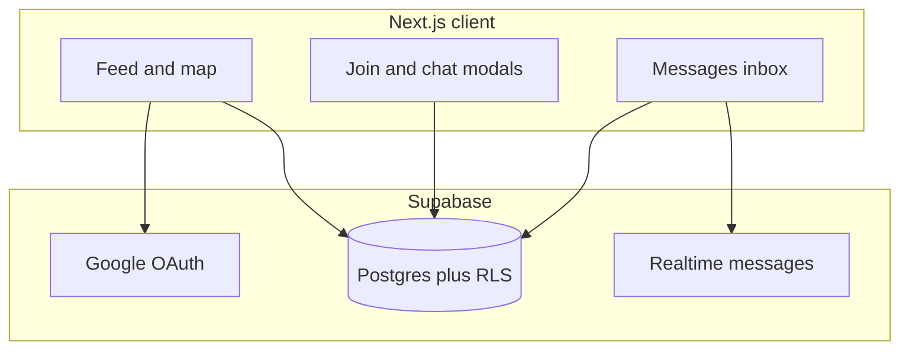

# Outzy

Meet new people through real-world activities. Browse plans near you, request to join with a short message, and chat once the host accepts.

**[Live demo](https://outzyy.vercel.app/)** · Sign in with Google. Use two accounts (or one plus an incognito window) to try the host and guest sides.


---

## Overview

Outzy is a platform for meeting new people through real-world activities. Don't have anyone to go to a cafe, a hike, or a gym class with? Browse plans happening near you, request to join, and connect with people who want to go along.

## Why I built it

I built Outzy for myself. I'm back in my hometown after living elsewhere and don't know many people here. I wanted a way to meet new people, explore new places, and find others with similar interests, like fellow developers. Existing social apps are built around feeds and followers, not around doing one specific thing together, so I built something focused on that.

## The problem

- **Discovery**: it's hard to see what's happening nearby, by category and time, or on a map.
- **Trust**: you want to know who is hosting, and hosts want to read a guest's message before accepting.
- **Coordination**: people shouldn't have to swap phone numbers too early. The plan, the host and the guest should stay tied together in one thread.

## Goals

- Ship an end-to-end flow: discover, request to join, accept or reject, chat.
- Make it feel good on mobile, with a bottom nav, a full-screen chat and readable cards.
- Keep data secure by default using Supabase Row Level Security, not just by hiding things in the UI.

## What you can do

A visitor lands on the home page and clicks **Get early access** to sign in with Google (via Supabase Auth). After login they arrive at the **feed**, which shows activities near them sorted by distance (nearest first), plus the activities they've created. They can filter by category and switch between a **list view** and a **map view** with pinned activities. Distance sorting uses the browser's location, so users need to allow location access.

If nothing nearby interests them, anyone can **create an activity**: a title, a description, how many people they need, a time, a category, and a location. Instead of an exact address, the host enters a landmark, which is shown on a map.

To join a plan, a guest sends the host a short note explaining why they want to come. The host sees the request and can **accept or reject** it. Once accepted, the host and guest get a **private 1:1 chat**, powered by Supabase Realtime, so messages appear live without refreshing. Chat opens only after acceptance, so people don't have to share contact details until the host agrees.

### Also built

- A **Messages** inbox that lists every conversation, with unread badges in the navigation.
- A host view to edit a plan after posting it.
- Cards that use a category gradient and emoji instead of external images, so nothing breaks when a third-party image goes missing.
- A mobile-friendly layout, with bottom navigation and a full-height chat modal.

## How it's built



- **Next.js (App Router), React and TypeScript**: the frontend, routing, and a few server API routes such as geocoding.
- **Supabase**: Google sign-in (Auth), the Postgres database, Row Level Security for access control, and Realtime for live chat and unread counts. I use `@supabase/supabase-js` for queries and `@supabase/ssr` to manage login sessions in Next.js. A database function (RPC) creates the chat thread once a request is accepted.
- **Leaflet and react-leaflet**: the interactive maps on the feed and the location picker.
- **Nominatim (OpenStreetMap)**: turns a landmark into map coordinates, called through server API routes.
- **Tailwind CSS and lucide-react**: styling and icons.

### Why Supabase

I chose Supabase because I wanted to ship a complete product quickly without running my own backend. It gave me Google login, a Postgres database, realtime chat, and row-level security in one place. Since the browser talks to the database directly, I rely on RLS policies to control who can read and write what.

## Security

The browser talks to the database directly using Supabase's public anon key, so access control has to live in the database. I use Row Level Security (RLS) on every sensitive table, so Postgres decides who can see or change each row, no matter what the UI shows.

- **Profiles**: any signed-in user can read them, but you can only create or edit your own.
- **Join requests**: guests create them, the host and the guest can read them, and only the host can accept or reject.
- **Activities**: signed-in users can read them, and only the host can edit or delete their own.
- **Chats and messages**: only the host and the guest of a conversation can read or send messages.

The SQL migrations in `supabase/migrations/` define all of this and must run in filename order.

## Tradeoffs and learnings

- Chat opens in a modal so people stay on the feed, while the Messages page gives a full inbox and direct links.
- One shared Realtime channel handles unread counts, which avoids duplicate channel names when two parts of the navigation use the same hook.
- Cards use gradients and emoji instead of external GIFs, which often broke.
- The migrations live in the repo, so the full database setup can be reviewed and rebuilt.

## Known limitations

- RLS works on rows, not columns, so any signed-in user can read an activity's coordinates. Showing only an approximate location until a request is accepted is a planned fix.
- There are no email or push notifications, so people only see new requests and messages when they open the app.
- Geocoding uses the free public Nominatim service, which has usage limits.

## What's next

- Last-message preview in the Messages list
- Email or push notifications when a request or message arrives
- Stronger host tools, such as a waitlist

---

## Try it: demo flow

Use two Google accounts (or one account plus an incognito window):

1. **Host (A)**: sign in, finish onboarding, then **Create activity**. It appears on the feed under **Yours**.
2. **Guest (B)**: sign in, open **Nearby**, and send a join request with a note on A's plan.
3. **Host (A)**: open **Requests**, read the message, and **Accept**. The chat opens.
4. **Guest (B)**: open the chat and send a message. Host A sees it live.
5. **Both**: open **Messages** in the nav. The unread badge clears after opening the thread.

## Run locally

```bash
pnpm install   # or: npm install
cp .env.example .env.local   # fill in your Supabase keys
pnpm dev       # or: npm run dev
```

Open [http://localhost:3000](http://localhost:3000).

| Variable | Where to find it |
|----------|------------------|
| `NEXT_PUBLIC_SUPABASE_URL` | Supabase → Project Settings → API |
| `NEXT_PUBLIC_SUPABASE_ANON_KEY` | Supabase → Project Settings → API (anon public key) |

## Deploy

1. Run all files in `supabase/migrations/` in filename order.
2. In Supabase → **Authentication → Providers → Google**, enable Google and add your OAuth Client ID and secret. In Google Cloud Console, add `https://<project-ref>.supabase.co/auth/v1/callback` as an authorized redirect URI.
3. Push the repo to GitHub, import it in [Vercel](https://vercel.com), and set the two environment variables above.
4. In Supabase → **Authentication → URL Configuration**, set **Site URL** to `https://<your-domain>` and add Redirect URLs `https://<your-domain>/**` and `http://localhost:3000/**`.
5. Check that `messages` is enabled in **Database → Publications → supabase_realtime**.

## Project structure

- `/feed`: discovery, filters, map, join requests
- `/messages`: conversation list and chat modal
- `/activity/[id]`: view and edit a plan (host)
- `/profile`: user profile and hosted plans
- `components/`: shared activity card, chat modal and chat panel
- `supabase/migrations`: schema, RLS policies, RPCs, realtime setup

