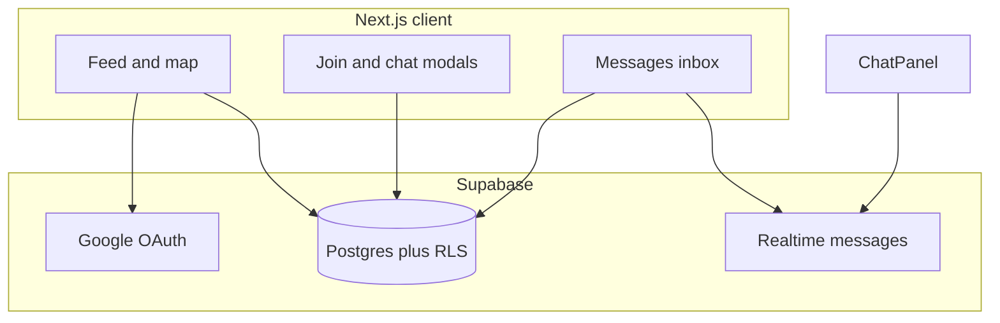

# Outzy

Find people to do things with — discover plans near you, request to join with a short message, and coordinate in-app after the host accepts.

**[Live demo](https://your-app.vercel.app)** — replace with your Vercel URL after deploy.

---

## Case study

### Context

Many people want to do something specific — a hike, coffee, a run, game night — but do not have someone to go with. Large social networks are built for feeds and followers, not for **one plan, one host, a few guests, and a clear outcome**.

Outzy is a focused product for **real-world activities**: post a plan, let others request to join with context, and move coordination into chat only after the host accepts.

### Problem

- **Discovery** — See what is happening nearby (or on a map), filtered by category and time.
- **Trust** — Know who is hosting; read their profile and the guest’s message before accepting.
- **Coordination** — Avoid swapping phone numbers too early; keep thread, host, and plan tied together.

### Goals

- Ship an end-to-end flow: discover → join request → accept/reject → chat.
- Feel good on mobile (bottom nav, full-screen chat modal, readable cards).
- Demonstrate **security by default** with Supabase Row Level Security, not custom auth middleware alone.

### Role

End-to-end build: product flow, UI (Tailwind, shared activity cards), Next.js App Router frontend, Supabase schema, RLS policies, Realtime chat, and SQL migrations.

### Solution

Outzy centers on **activities** as the unit of social intent. Guests browse the feed (list or map), send a **join request with a message**, and wait for the host. Hosts manage requests from the feed, accept or decline, and open a **1:1 chat** tied to that plan and guest. A **Messages** inbox lists all conversations; unread counts appear in the nav.



### Key features

| Area | What it does |
|------|----------------|
| Landing + auth | Marketing page, Google OAuth, onboarding for username/bio/city ([`app/page.tsx`](app/page.tsx), [`app/onboarding/page.tsx`](app/onboarding/page.tsx)) |
| Feed | Nearby vs yours, categories, upcoming/past, list + Leaflet map, geolocation distance ([`app/feed/page.tsx`](app/feed/page.tsx)) |
| Join requests | Guest message in a modal; host reviews in a requests modal; accept/reject |
| Activities | Host view/edit plan at [`app/activity/[id]/page.tsx`](app/activity/[id]/page.tsx) |
| Chat | Inbox at [`app/messages/page.tsx`](app/messages/page.tsx); centered full-height modal ([`components/chat-modal.tsx`](components/chat-modal.tsx)); live messages ([`components/chat-panel.tsx`](components/chat-panel.tsx)) |
| Unread | Badges on Messages (nav + per thread) via [`lib/use-unread-messages.ts`](lib/use-unread-messages.ts) |
| UI system | One card component everywhere ([`components/feed-activity-card.tsx`](components/feed-activity-card.tsx)); category headers use gradient + emoji ([`lib/category-visual.ts`](lib/category-visual.ts)) |

Deep links: [`app/chat/[id]/page.tsx`](app/chat/[id]/page.tsx) redirects to `/messages?open=<conversationId>`.

### Technical approach

| Layer | Choice |
|-------|--------|
| Frontend | Next.js (App Router), React, Tailwind CSS |
| Backend | Supabase Postgres + Auth |
| Auth | Google OAuth; session on client via `@supabase/supabase-js` |
| Authorization | **RLS** on all sensitive tables; browser uses **anon key only** |
| Realtime | Supabase `postgres_changes` on `messages` for live chat and unread refresh |
| Maps / geo | Leaflet on feed; Nominatim via [`app/api/geocode`](app/api/geocode) and reverse geocode routes |

Conversation creation uses an RPC (`ensure_conversation_for_request`) so host or guest can recover a thread after accept, with grants documented in migrations.

**Why RLS** — Policies enforce “host or guest only” for chat and “host updates request status” in the database. The app does not rely on hiding IDs in the UI alone.

### Security and data

| Table | Purpose |
|-------|---------|
| `users` | Profiles (username, bio, city, interests) |
| `activities` | Plans with optional lat/lng |
| `activity_requests` | Guest message + pending / accepted / rejected |
| `conversations` | One thread per activity + guest; read cursors for unread |
| `messages` | Chat bodies in a conversation |

Row Level Security highlights:

- **`users`** — authenticated read; insert/update own row only ([`20260328130000`](supabase/migrations/20260328130000_users_select_authenticated.sql), [`20260328150000`](supabase/migrations/20260328150000_users_write_own_profile.sql)).
- **`activity_requests`** — guests insert; host/guest read rules; host updates status ([`20260328140000`](supabase/migrations/20260328140000_activity_requests.sql)).
- **`activities`** — authenticated read; host CRUD own rows ([`20260328160000`](supabase/migrations/20260328160000_activities_rls.sql)).
- **`conversations` / `messages`** — participants only ([`20260328170000`](supabase/migrations/20260328170000_conversations_messages.sql), [`20260328180000`](supabase/migrations/20260328180000_chat_grants_and_backfill_rpc.sql), [`20260328180100`](supabase/migrations/20260328180100_fix_ensure_conversation_rpc.sql)).
- **Realtime + unread** — [`20260328190000`](supabase/migrations/20260328190000_messages_realtime.sql), [`20260328200000`](supabase/migrations/20260328200000_conversation_read_state.sql) (`host_last_read_at` / `guest_last_read_at`, `get_my_unread_counts`, `mark_conversation_read`).

Apply all files in [`supabase/migrations/`](supabase/migrations/) **in filename order** via Supabase SQL Editor or `supabase db push`.

### Tradeoffs and learnings

- **Chat in a modal** keeps users on the feed; Messages provides a dedicated inbox and deep links.
- **One shared Realtime channel** for unread totals avoids duplicate Supabase channel names when navbar and mobile nav both mount hooks.
- **Gradient + emoji card covers** replaced third-party GIFs that often 404; zero external media requests on cards.
- **Migrations are explicit** in-repo for portfolio review; production Supabase must run the full chain through `20260328200000`.

### Outcomes

A reviewer with two Google accounts can validate the full story in about five minutes using the demo script below.

### What’s next (not built yet)

- Last-message preview on the Messages list
- Push or email when a request or message arrives
- Stronger host tools (waitlist, cap enforcement UI)

---

## Stack

- **Next.js** (App Router) + React
- **Supabase** — Auth (Google OAuth), Postgres, Row Level Security, **Realtime**
- **Leaflet** — feed map and location picker
- **Tailwind CSS**

## Core flow (demo script)

Use two Google accounts (or one account + incognito):

1. **Host (A)** — Sign in → onboarding → **Create activity** → appears on **Feed** under **Yours**.
2. **Guest (B)** — Sign in → **Nearby** → **Message host** on A’s plan → send join request with a note.
3. **Host (A)** — **Requests** on the card (or banner) → read message → **Accept** → **chat modal** opens.
4. **Guest (B)** — Card shows **Open chat**; send a message; **Host (A)** sees it in realtime without refresh.
5. **Both** — Open **Messages** in the nav; unread badge clears after opening the thread.
6. **Host (A)** — **Edit** on the card or `/activity/[id]` to update the plan.

## Deploy

Deploy to [Vercel](https://vercel.com) and set env vars from [`.env.example`](.env.example).

In Supabase **Authentication → URL configuration**, set **Site URL** to your production origin and add **Redirect URLs**, for example:

- `https://<your-domain>/feed`
- `https://<your-domain>/onboarding`
- `https://<your-domain>/create-activity`
- `https://<your-domain>/messages`
- `https://<your-domain>/profile`
- `https://<your-domain>/chat/**`
- `http://localhost:3000/**` (local dev)

## Local development

```bash
pnpm install
cp .env.example .env.local   # fill in Supabase keys
pnpm dev
```

Open [http://localhost:3000](http://localhost:3000).

## Project structure

- `app/feed` — discovery, filters, map, join requests, chat modal entry
- `app/messages` — conversation list and chat modal
- `app/chat/[id]` — redirect to `/messages?open=…`
- `app/activity/[id]` — view / edit plan (host)
- `app/profile` — user profile and hosted plans
- `components/feed-activity-card.tsx` — shared activity card UI
- `components/chat-modal.tsx`, `components/chat-panel.tsx` — messaging UI

## License

Private / portfolio use.
